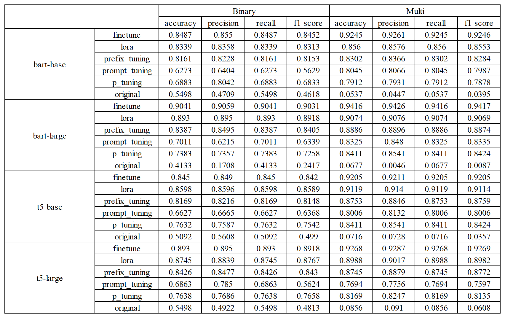
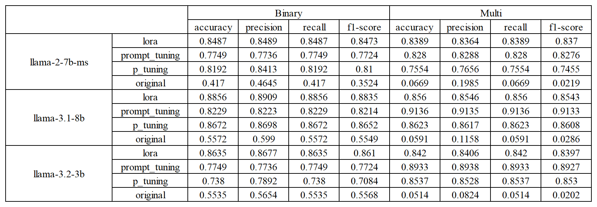
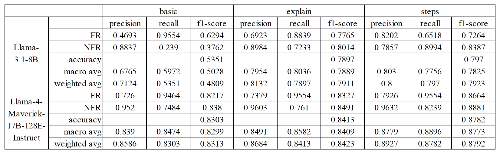
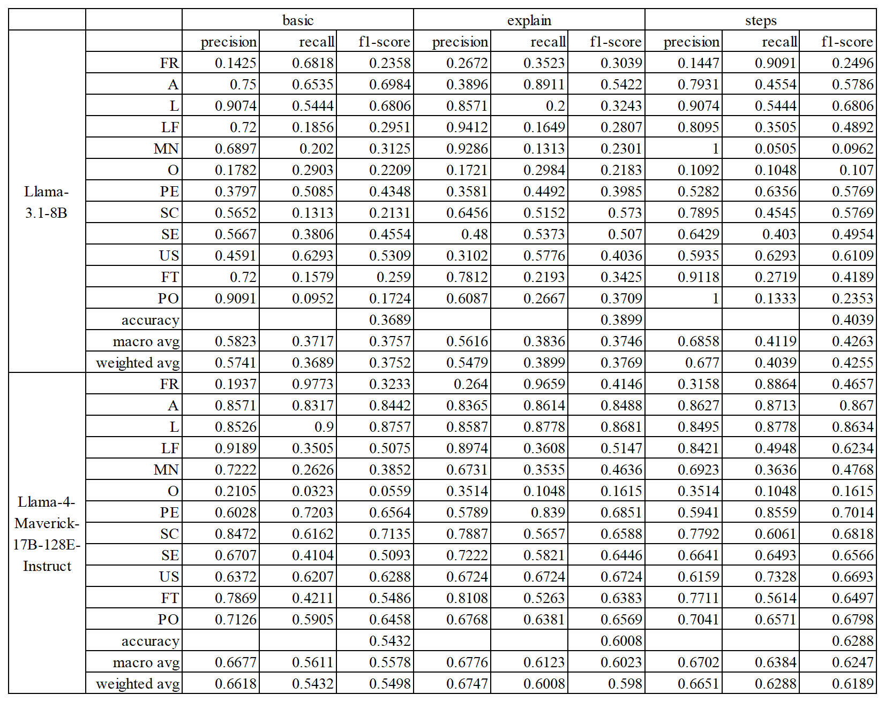

# results-llm-requirements-classification
Complete experimental results for the paper “Requirement Classification with Large Language Models: Empirical Insights into Fine-Tuning and Prompting Techniques”: binary &amp; 12-class metrics.

# Results — LLMs for Requirements Classification
Complete experimental results for the paper **“Requirement Classification with Large Language Models: Empirical Insights into Fine-Tuning and Prompting Techniques.”**  
Tasks: **Binary (FR vs. NFR)** and **12-Class (FR + 11 NFR subcategories)**.  
Experiments: **Tuning on non-instruction checkpoints** and **Prompting-only on instruction-tuned models**.
**Full metrics tables**: Accuracy, Weighted-Precision, Weighted-Recall and Weighted-F1 for RQ1–RQ3.

---

# RQ1 & RQ2
Full results for fine-tuning methods (RQ1) and for model size/architecture comparisons (RQ2) are summarized in the three tables below.

📊 **Encoder-only**


📊 **Encoder-Decoder**


📊 **Decoder-only**


---

# RQ3
We evaluate **six prompting templates** (2 tasks × 3 styles). All templates enforce an exact final label in `<label>…</label>`.

**Binary — Basic**
```text
System: You are a precise software requirements engineer.
Follow instructions exactly and respect output constraints.

User: Decide whether the following requirement is a Functional Requirement (FR)
or a Non-Functional Requirement (NFR).

Requirement:
{requirement}

Final rules:
- Output the final line exactly as one of:
  <label>FR</label>  or  <label>NFR</label>
- Do not output anything after </label>.

Answer:
```
**Binary — Explain**
```text
System: You are a precise software requirements engineer.
Provide a concise, audit-friendly result.

User: Classify the requirement as FR (functional behavior the system must perform)
or NFR (constraints such as performance, security, usability, reliability,
maintainability, availability, scalability, operability, look & feel, licensing, portability).

Requirement:
{requirement}

Output format (two lines):
Reason: <= 12 words (short and concrete)
<label>FR</label>  or  <label>NFR</label>

Final rules:
- The second line must be exactly <label>FR</label> or <label>NFR</label>.
- Do not output anything after </label>.
```
**Binary — Steps**
```text
System: You are a precise software requirements engineer.
Think step by step briefly.

User: Classify the requirement into FR (functional behavior) or NFR (quality/constraint).

Requirement:
{requirement}

Let's think step by step in 3 bullets:
1) Does it describe a system behavior/output?
2) If not, which quality/constraint is emphasized?
3) Resolve ambiguity and choose one.

Final rules:
- After the bullets, output a single final line with exactly one of:
  <label>FR</label>  or  <label>NFR</label>
- Do not output anything after </label>.

Answer:
```
**Multi — Basic**
```text
System: You are a precise software requirements engineer. Follow instructions exactly.

User: Classify the requirement into exactly one of the following 12 categories
(output only the ALL-CAPS abbreviation):
- FR  Functional Requirement
- A   Availability
- L   Legal & Licensing
- LF  Look & Feel
- MN  Maintainability
- O   Operability
- PE  Performance
- SC  Scalability
- SE  Security
- US  Usability
- FT  Fault Tolerance
- PO  Portability

Requirement:
{requirement}

Final rules:
- Output the final line exactly as one of:
  <label>FR</label>, <label>A</label>, <label>L</label>, <label>LF</label>, <label>MN</label>,
  <label>O</label>, <label>PE</label>, <label>SC</label>, <label>SE</label>, <label>US</label>,
  <label>FT</label>, <label>PO</label>
- Do not output anything after </label>.

Answer:
```
**Multi — Explain**
```text
System: You are a precise software requirements engineer. Provide a concise, audit-friendly result.

User: Classify the requirement into one of the 12 categories (output only the abbreviation):
- FR  Functional Requirement
- A   Availability
- L   Legal & Licensing
- LF  Look & Feel
- MN  Maintainability
- O   Operability
- PE  Performance
- SC  Scalability
- SE  Security
- US  Usability
- FT  Fault Tolerance
- PO  Portability

Hints:
- FR: functional behavior/output the system must perform.
- Non-functional (A/L/LF/MN/O/PE/SC/SE/US/FT/PO): quality or constraint dimension.

Requirement:
{requirement}

Output format (two lines):
Reason: <= 12 words (short and concrete)
<label>FR</label> / <label>A</label> / <label>L</label> / <label>LF</label> / <label>MN</label> /
<label>O</label> / <label>PE</label> / <label>SC</label> / <label>SE</label> / <label>US</label> /
<label>FT</label> / <label>PO</label>

Final rules:
- The second line must be exactly one <label>...</label> from the list.
- Do not output anything after </label>.
```
**Multi — Steps**
```text
System: You are a precise software requirements engineer. Think step by step briefly.

User: Classify the requirement into exactly one of the 12 categories (output only the abbreviation):
- FR  Functional Requirement
- A   Availability
- L   Legal & Licensing
- LF  Look & Feel
- MN  Maintainability
- O   Operability
- PE  Performance
- SC  Scalability
- SE  Security
- US  Usability
- FT  Fault Tolerance
- PO  Portability

Requirement:
{requirement}

Let's think step by step in 4 bullets:
1) Decide FR vs NFR (is it a concrete system behavior?).
2) If FR, stop and choose FR.
3) If NFR, identify which quality/constraint dimension best fits (A/L/LF/MN/O/PE/SC/SE/US/FT/PO).
4) Resolve ambiguity by picking the single best category.

Final rules:
- After the bullets, output a single final line with exactly one of:
  <label>FR</label>, <label>A</label>, <label>L</label>, <label>LF</label>, <label>MN</label>,
  <label>O</label>, <label>PE</label>, <label>SC</label>, <label>SE</label>, <label>US</label>,
  <label>FT</label>, <label>PO</label>
- Do not output anything after </label>.

Answer:
```
The prompting-only results are presented below.

📊 **Binary**

📊 **Multi**

