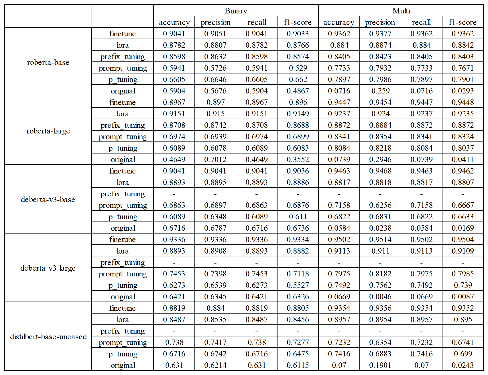
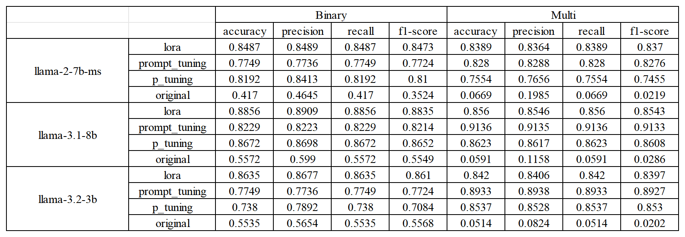

# results-llm-requirements-classification
Complete experimental results for the paper “Requirement Classification with Large Language Models: Empirical Insights into Fine-Tuning and Prompting Techniques”: binary &amp; 12-class metrics.

# Results — LLMs for Requirements Classification
Complete experimental results for the paper **“Requirement Classification with Large Language Models: Empirical Insights into Fine-Tuning and Prompting Techniques.”**  
Tasks: **Binary (FR vs. NFR)** and **12-Class (FR + 11 NFR subcategories)**.  
Experiments: **Tuning on non-instruction checkpoints** and **Prompting-only on instruction-tuned models**.
**Full metrics tables**: Accuracy, Weighted-Precision, Weighted-Recall and Weighted-F1 for RQ1–RQ3.

---

## 📊 Encoder-only

## 📊 Encoder-Decoder

## 📊 Decoder-only

