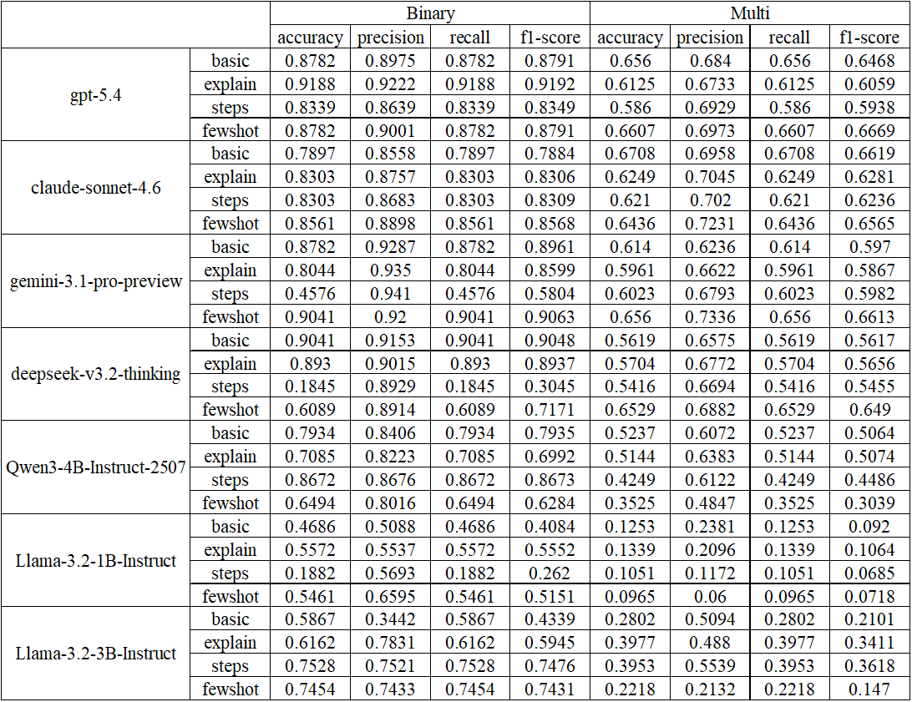
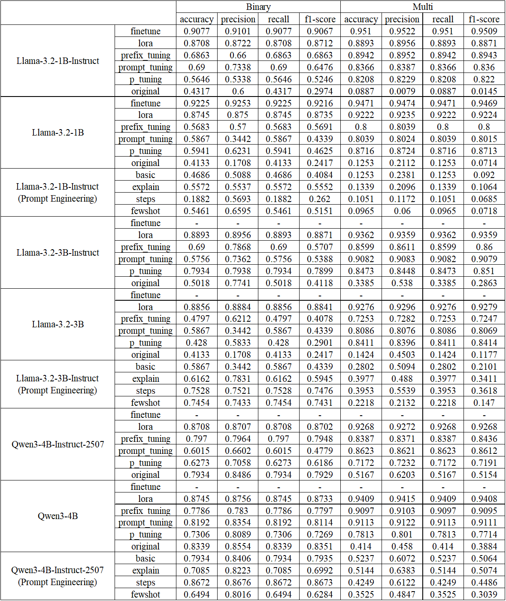

# results-llm-requirements-classification
Complete experimental results for the paper “Requirements Classification with Large Language Models under a Unified Experimental Framework: A Systematic Empirical Study”: 

## Dataset — Enhanced Dataset for Requirements Classification

This repository releases the datasets used in our requirements-classification study. The dataset/ folder includes the base corpus PROMISE.csv, the cleaned/normalized merge Original-Data.csv, and scale-up files LLM-generate.csv and LLM-generate+Paraphrasing_1–3.csv. Standard experimental splits are under dataset_binary/ (FR vs. NFR) and dataset_multi/ (12 classes). Each subfolder provides train.csv, val.csv, and test.csv. Rows contain the requirement text in Requirement and the label in Specific_Type (FR or one of {FR, A, L, LF, MN, O, PE, SC, SE, US, FT, PO}).

---

## Code Overview
The code/ folder contains the core scripts used in our experiments. Under this folder, we provide training/evaluation pipelines for the three backbone families: encoder-only_2.py / encoder-only_12.py, encoder-decoder_2.py / encoder-decoder_12.py, and decoder-only_2.py / decoder-only_12.py, covering the binary (FR vs. NFR) and 12-class tasks under a unified protocol.

---

## Results — LLMs for Requirements Classification
Complete experimental results for the paper **“Requirement Classification with Large Language Models: Empirical Insights into Fine-Tuning and Prompting Techniques.”**  
Tasks: **Binary (FR vs. NFR)** and **12-Class (FR + 11 NFR subcategories)**.  
Experiments: **Tuning on non-instruction checkpoints** and **Prompting-only on instruction-tuned models**.
**Full metrics tables**: Accuracy, Weighted-Precision, Weighted-Recall and Weighted-F1 for RQ1–RQ3.

---

### RQ1 & RQ2
Full results for fine-tuning methods (RQ1) and for model size/architecture comparisons (RQ2) are summarized in the three tables below.

📊 **Encoder-only**


📊 **Encoder-Decoder**


📊 **Decoder-only**


---

### RQ3
We evaluate **six prompting templates** (2 tasks × 4 styles). All templates enforce an exact final label in `<label>…</label>`.

**Binary — Basic**
```text
System: You are a precise software requirements engineer.
Follow instructions exactly and respect output constraints.

User: Decide whether the following requirement is a Functional Requirement (FR)
or a Non-Functional Requirement (NFR).

Requirement:
{requirement}

Final rules:
- Output the final line exactly as one of:
  <label>FR</label>  or  <label>NFR</label>
- Do not output anything after </label>.

Answer:
```
**Binary — Explain**
```text
System: You are a precise software requirements engineer.
Provide a concise, audit-friendly result.

User: Classify the requirement as FR (functional behavior the system must perform)
or NFR (constraints such as performance, security, usability, reliability,
maintainability, availability, scalability, operability, look & feel, licensing, portability).

Requirement:
{requirement}

Output format (two lines):
Reason: <= 12 words (short and concrete)
<label>FR</label>  or  <label>NFR</label>

Final rules:
- The second line must be exactly <label>FR</label> or <label>NFR</label>.
- Do not output anything after </label>.
```
**Binary — Steps**
```text
System: You are a precise software requirements engineer.
Think step by step briefly.

User: Classify the requirement into FR (functional behavior) or NFR (quality/constraint).

Requirement:
{requirement}

Let's think step by step in 3 bullets:
1) Does it describe a system behavior/output?
2) If not, which quality/constraint is emphasized?
3) Resolve ambiguity and choose one.

Final rules:
- After the bullets, output a single final line with exactly one of:
  <label>FR</label>  or  <label>NFR</label>
- Do not output anything after </label>.

Answer:
```
**Binary — Few-shot**
```text
System:
You are a precise software requirements engineer. Use few-shot examples and return only one final label tag.

User:
Requirement:
The system shall have a MDI form that allows for the viewing of the graph and the data table.

Classify into FR or NFR. Output exactly one line:
<label>...</label>

Assistant:
<label>FR</label>

User:
Requirement:
The system must authenticate users prior to accessing an application or data.

Classify into FR or NFR. Output exactly one line:
<label>...</label>

Assistant:
<label>NFR</label>

User:
Requirement:
The system shall display the Events in a graph by time.

Classify into FR or NFR. Output exactly one line:
<label>...</label>

Assistant:
<label>FR</label>

User:
Requirement:
The product shall be available during normal business hours. As long as the user has access to the client PC the system will be available 99% of the time during the first six months of operation.

Classify into FR or NFR. Output exactly one line:
<label>...</label>

Assistant:
<label>NFR</label>

User:
Requirement:
The Disputes System must prevent users from accessing any dispute cases that do not belong to their cardholder base.

Classify into FR or NFR. Output exactly one line:
<label>...</label>

Assistant:
<label>FR</label>

User:
Requirement:
If projected the data must be understandable. On a 10x10 projection screen 90% of viewers must be able to determine that Events or Activities are occuring in current time from a viewing distance of 100

Classify into FR or NFR. Output exactly one line:
<label>...</label>

Assistant:
<label>NFR</label>

User:
Requirement:
{requirement}

Classify into FR or NFR.
Final rules:
- Output exactly one line as <label>...</label>
- Do not output anything else.
```
**Multi — Basic**
```text
System: You are a precise software requirements engineer. Follow instructions exactly.

User: Classify the requirement into exactly one of the following 12 categories
(output only the ALL-CAPS abbreviation):
- FR  Functional Requirement
- A   Availability
- L   Legal & Licensing
- LF  Look & Feel
- MN  Maintainability
- O   Operability
- PE  Performance
- SC  Scalability
- SE  Security
- US  Usability
- FT  Fault Tolerance
- PO  Portability

Requirement:
{requirement}

Final rules:
- Output the final line exactly as one of:
  <label>FR</label>, <label>A</label>, <label>L</label>, <label>LF</label>, <label>MN</label>,
  <label>O</label>, <label>PE</label>, <label>SC</label>, <label>SE</label>, <label>US</label>,
  <label>FT</label>, <label>PO</label>
- Do not output anything after </label>.

Answer:
```
**Multi — Explain**
```text
System: You are a precise software requirements engineer. Provide a concise, audit-friendly result.

User: Classify the requirement into one of the 12 categories (output only the abbreviation):
- FR  Functional Requirement
- A   Availability
- L   Legal & Licensing
- LF  Look & Feel
- MN  Maintainability
- O   Operability
- PE  Performance
- SC  Scalability
- SE  Security
- US  Usability
- FT  Fault Tolerance
- PO  Portability

Hints:
- FR: functional behavior/output the system must perform.
- Non-functional (A/L/LF/MN/O/PE/SC/SE/US/FT/PO): quality or constraint dimension.

Requirement:
{requirement}

Output format (two lines):
Reason: <= 12 words (short and concrete)
<label>FR</label> / <label>A</label> / <label>L</label> / <label>LF</label> / <label>MN</label> /
<label>O</label> / <label>PE</label> / <label>SC</label> / <label>SE</label> / <label>US</label> /
<label>FT</label> / <label>PO</label>

Final rules:
- The second line must be exactly one <label>...</label> from the list.
- Do not output anything after </label>.
```
**Multi — Steps**
```text
System: You are a precise software requirements engineer. Think step by step briefly.

User: Classify the requirement into exactly one of the 12 categories (output only the abbreviation):
- FR  Functional Requirement
- A   Availability
- L   Legal & Licensing
- LF  Look & Feel
- MN  Maintainability
- O   Operability
- PE  Performance
- SC  Scalability
- SE  Security
- US  Usability
- FT  Fault Tolerance
- PO  Portability

Requirement:
{requirement}

Let's think step by step in 4 bullets:
1) Decide FR vs NFR (is it a concrete system behavior?).
2) If FR, stop and choose FR.
3) If NFR, identify which quality/constraint dimension best fits (A/L/LF/MN/O/PE/SC/SE/US/FT/PO).
4) Resolve ambiguity by picking the single best category.

Final rules:
- After the bullets, output a single final line with exactly one of:
  <label>FR</label>, <label>A</label>, <label>L</label>, <label>LF</label>, <label>MN</label>,
  <label>O</label>, <label>PE</label>, <label>SC</label>, <label>SE</label>, <label>US</label>,
  <label>FT</label>, <label>PO</label>
- Do not output anything after </label>.

Answer:
```
**Multi — Few-shot**
```text
System:
You are a precise software requirements engineer. Use few-shot examples and return only one final label tag.

User:
Requirement:
The leads washing functionality will return the lead data supplied to the vendor along with the reason of rejection.

Classify into FR/A/L/LF/MN/O/PE/SC/SE/US/FT/PO. Output exactly one line:
<label>...</label>

Assistant:
<label>FR</label>

User:
Requirement:
Only planned maintenance periods will allow limited downtime.

Classify into FR/A/L/LF/MN/O/PE/SC/SE/US/FT/PO. Output exactly one line:
<label>...</label>

Assistant:
<label>A</label>

User:
Requirement:
The ESIGN Act requires the system to meet certain requirements.

Classify into FR/A/L/LF/MN/O/PE/SC/SE/US/FT/PO. Output exactly one line:
<label>...</label>

Assistant:
<label>L</label>

User:
Requirement:
The application will have background themes that reflect seasonal changes.

Classify into FR/A/L/LF/MN/O/PE/SC/SE/US/FT/PO. Output exactly one line:
<label>...</label>

Assistant:
<label>LF</label>

User:
Requirement:
End users will be able to easily switch between different application modes without affecting the overall performance of the product.

Classify into FR/A/L/LF/MN/O/PE/SC/SE/US/FT/PO. Output exactly one line:
<label>...</label>

Assistant:
<label>MN</label>

User:
Requirement:
Users must be allowed to integrate personal calendars.

Classify into FR/A/L/LF/MN/O/PE/SC/SE/US/FT/PO. Output exactly one line:
<label>...</label>

Assistant:
<label>O</label>

User:
Requirement:
Within 6 seconds of a completed purchase, the application will generate invoices.

Classify into FR/A/L/LF/MN/O/PE/SC/SE/US/FT/PO. Output exactly one line:
<label>...</label>

Assistant:
<label>PE</label>

User:
Requirement:
Streaming server shall support 75 simultaneous streaming connections, with the ability to scale up to 200 connections by Release 3.

Classify into FR/A/L/LF/MN/O/PE/SC/SE/US/FT/PO. Output exactly one line:
<label>...</label>

Assistant:
<label>SC</label>

User:
Requirement:
The system must protect user identities from other users.

Classify into FR/A/L/LF/MN/O/PE/SC/SE/US/FT/PO. Output exactly one line:
<label>...</label>

Assistant:
<label>SE</label>

User:
Requirement:
The system shall be easy to use by callers and supervisors. Callers and supervisors must be able to accomplish any system task within 2 minutes.

Classify into FR/A/L/LF/MN/O/PE/SC/SE/US/FT/PO. Output exactly one line:
<label>...</label>

Assistant:
<label>US</label>

User:
Requirement:
The system will make sure that user preferences are kept safe.

Classify into FR/A/L/LF/MN/O/PE/SC/SE/US/FT/PO. Output exactly one line:
<label>...</label>

Assistant:
<label>FT</label>

User:
Requirement:
Application should be able to run on various network configurations, including Wi-Fi and Ethernet connections.

Classify into FR/A/L/LF/MN/O/PE/SC/SE/US/FT/PO. Output exactly one line:
<label>...</label>

Assistant:
<label>PO</label>

User:
Requirement:
{requirement}

Classify into FR/A/L/LF/MN/O/PE/SC/SE/US/FT/PO.
Final rules:
- Output exactly one line as <label>...</label>
- Do not output anything else.
```
The prompting-only results are presented below.

📊 **RQ3**


📊 **RQ4**

